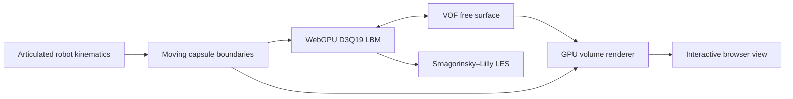

# AquaEmbodied WebGPU

**Browser-native Physical AI for robots operating beyond air.**

[](https://www.w3.org/TR/webgpu/)
[](https://www.typescriptlang.org/)
[](#physics-engine)
[](#project-status)

## Live demonstration

### [Launch AquaEmbodied WebGPU](https://bot-in-water.960921332.xyz/)

AquaEmbodied WebGPU is an open, browser-based research platform for embodied
robotics in non-air media. Its first benchmark places a connected humanoid robot
inside a free-surface water domain and resolves the dynamic interaction between
prescribed articulated motion and the surrounding fluid entirely through WebGPU.

The project connects three research areas that are often developed separately:

- **Embodied intelligence:** the body, joints, environment and task are represented
  as one interactive system rather than an isolated controller.
- **Robot–fluid interaction:** moving robot surfaces exchange momentum with a
  three-dimensional free-surface flow through lattice-resolved boundary coupling.
- **Physical AI:** the simulator is intended as a transparent physics layer for
  future policy evaluation, synthetic data generation and environment-aware motion
  design outside conventional air-only robotics benchmarks.

## Robotics beyond air

Most embodied-AI simulators assume that a robot moves in air and that the medium
can be ignored. AquaEmbodied is built around the opposite requirement: the
surrounding medium is part of the task.

| Environment | Research use | Current support |
| --- | --- | --- |
| Surface and shallow water | Splashing, locomotion, manipulation and free-surface disturbance | **Implemented in this release** |
| Fully submerged water | Hydrodynamic resistance and articulated motion below an interface | Solver foundation available; dedicated benchmark in development |
| Deep-ocean-like media | High-viscosity/high-density parameter studies, confined boundaries and subsea robot concepts | Extensible configuration target; hydrostatic-pressure and compressibility extensions are still required for true depth fidelity |
| Reduced gravity and space fluids | Free-surface motion under low gravity, spacecraft liquid interaction and robot motion around contained liquids | Gravity and boundary parameters are configurable; vacuum and full spacecraft dynamics are outside the current release |
| Other non-air media | Parameterized liquid analogues for industrial, hazardous or extraterrestrial environments | Supported as a research extension through constitutive and boundary modules |

This distinction matters: the repository already simulates a robot dynamically
disturbing water, while deep-sea pressure physics, vacuum dynamics and learned robot
control remain explicit research extensions rather than claimed finished features.

## What the current benchmark demonstrates

- Six independent 10-second articulated dance routines: water slaps, floor sweeps,
  standing kicks, horse-stance strikes, rolling sweeps and jump splashes.
- A connected capsule-based humanoid with fixed segment lengths and continuous
  moving-wall velocities.
- Three-dimensional free-surface waves and splashes driven by robot motion.
- Interactive orbit, zoom and pan controls with live physical simulation time.
- Runtime controls for viscosity, surface tension, water level, choreography speed,
  duration and grid resolution.
- Periodic lateral boundaries with solid floor and ceiling walls.
- A standalone static deployment: computation and rendering run locally on the
  visitor's GPU, with no simulation backend.

## Physics engine

The current implementation combines:

- FP32 D3Q19 lattice Boltzmann fluid dynamics;
- volume-of-fluid free-surface reconstruction;
- Smagorinsky–Lilly large-eddy regularization;
- surface tension and configurable contact angles;
- prescribed articulated capsule geometry;
- moving no-slip wall coupling;
- GPU-resident field storage and direct volume rendering.



The robot trajectory is currently prescribed. It drives the fluid, but fluid forces
do not yet alter the robot's motion. This is kinematic fluid–solid coupling and is a
deliberate first step toward two-way robot dynamics and learned control.

## Architecture

```text
src/robot-motion.ts        Connected robot skeleton and six motion programs
src/robot-config.ts        Physical parameters and lattice/time conversion
src/gpu.ts                 WebGPU solver orchestration and GPU resources
src/shaders/*.wgsl         LBM, VOF, LES, geometry and rendering kernels
src/view3d.ts              Interactive GPU volume and robot rendering
public/robotInputParameter.json
                           Editable runtime defaults
```

See [docs/ENVIRONMENTS.md](docs/ENVIRONMENTS.md) for the environment roadmap and
[docs/ARCHITECTURE.md](docs/ARCHITECTURE.md) for the simulation pipeline.

## Run locally

Requirements:

- Node.js 20 or newer;
- pnpm;
- a recent WebGPU-capable Chrome or Edge browser;
- hardware acceleration enabled.

```bash
pnpm install
pnpm dev
```

Open <http://bot-in-water.960921332.xyz/>. Windows users may also run `start.bat`.

## Test and build

```bash
pnpm test
pnpm build
```

The test suite checks articulated-body connectivity, choreography separation,
moving-wall velocity consistency, transition continuity, domain containment,
boundary topology and parameter scaling. The production site is generated in
`dist/`.

## Deploy

For Cloudflare Pages or Workers static assets:

```text
Build command:    pnpm build
Output directory: dist
```

The application is fully static. WebGPU requires HTTPS in production; Cloudflare
provides HTTPS automatically for deployed projects and custom domains.

## Configuration

Edit `public/robotInputParameter.json`, then reload the page or select
**Apply & reset**. Values are stored in lattice units. The UI presets are derived
from this file rather than duplicated in the application.

## Project status

AquaEmbodied WebGPU is a research preview, not an engineering-certification tool.
The current release focuses on visually and numerically coherent prescribed robot
motion in free-surface water. Planned work includes two-way rigid-body feedback,
controller APIs, submerged benchmarks, pressure-aware deep-ocean models,
microgravity containers, validation datasets and reinforcement-learning interfaces.

## Contributing

Research contributions, numerical validation cases, WebGPU performance work and
robot-motion benchmarks are welcome. Read [CONTRIBUTING.md](CONTRIBUTING.md) before
opening a pull request.

## License and attribution

This repository is publicly source-available for research, education and personal
use. Some numerical techniques were adapted from projects with restrictions beyond
an OSI-approved open-source license. Commercial use, military use and training AI
models on restricted source code are not permitted without the relevant copyright
holder's authorization. Read [LICENSE.md](LICENSE.md) and
[THIRD_PARTY_NOTICES.md](THIRD_PARTY_NOTICES.md) before reuse.

Detailed legal attribution for adapted numerical work is isolated in
[`THIRD_PARTY_NOTICES.md`](THIRD_PARTY_NOTICES.md) and does not define the public
identity or research direction of AquaEmbodied WebGPU.
